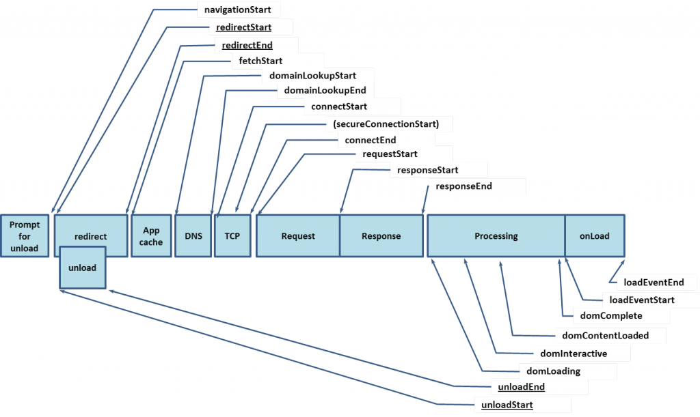

## 使用`window.performance`进行浏览器性能测试
> 引自`MDN Web Docs`

### 理解浏览器的加载顺序

- - -

Web Performance API允许网页访问某些函数来测量网页和Web应用程序的性能，包括 Navigation Timing API和高分辨率时间数据。

### 方法

`performance.mark()`

通过一个给定的名称，将该名称（作为键）和对应的`DOMHighResTimeStamp`（作为值）保存在一个哈希结构里。该键值对表示了从某一时刻
`（译者注：某一时刻通常是 navigationStart 事件发生时刻）`到记录时刻间隔的毫秒数。
`（译者注：该方法一般用来多次记录时间，用于求得各记录间的时间差）`

`performance.now()`

该方法返回一个`DOMHighResTimeStamp`对象，该对象表示从某一时刻
`（译者注：某一时刻通常是 navigationStart 事件发生时刻）`到调用该方法时刻的毫秒数。

- - -
### 属性

`performance.timing`
是一个`PerformanceTiming` 对象,包含延迟相关的性能信息。

`performance.navigation`
是一个 `PerformanceNavigation` 对象，该对象表示在当前给定浏览上下文中网页导航的类型
`（译者注：TYPE_BACK_FORWARD，TYPE_NAVIGATE， TYPE_RELOAD，TYPE_RESERVED）`以及次数。
